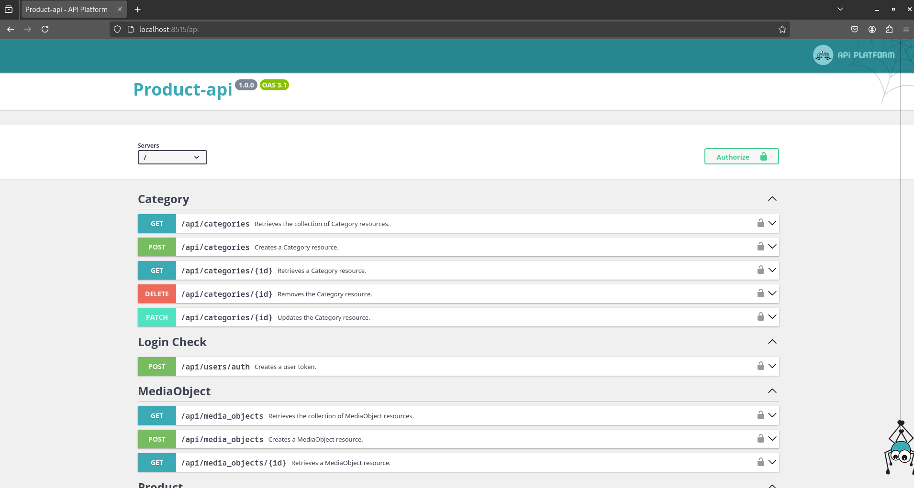
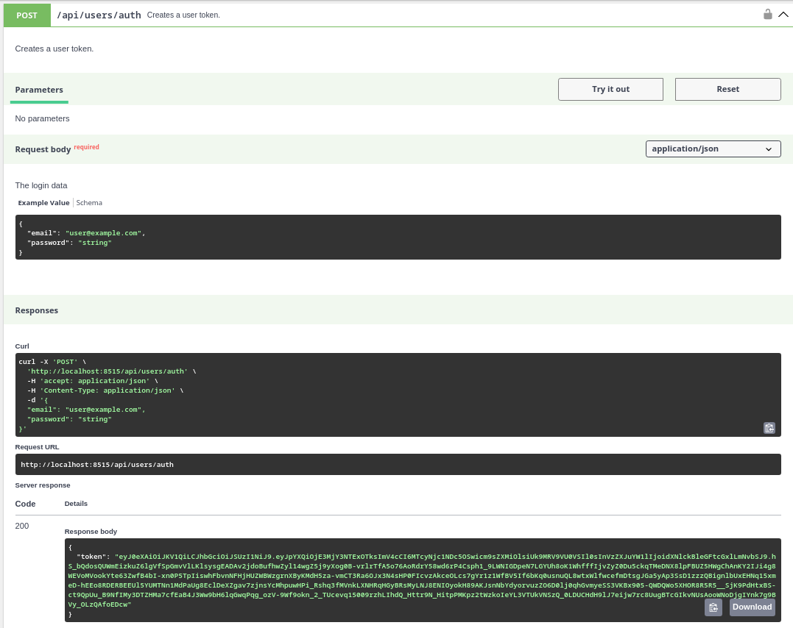
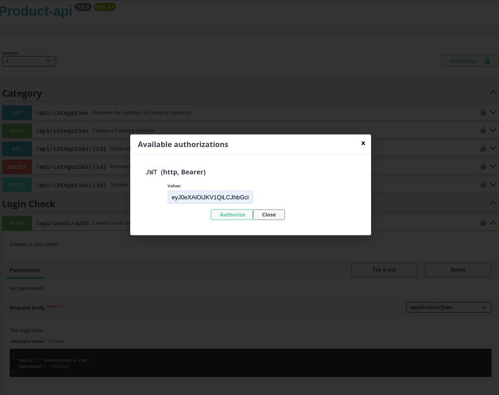

# Product-API

## Описание

Product-API — это API для управления каталогом товаров, созданное на базе Symfony и Api Platform. Проект предоставляет возможности для работы с товарами через REST API.

## Технологии

Проект построен с использованием следующих технологий:
- **PHP**
- **Symfony**
- **Api Platform**
- **MySQL**
- **Docker**

## Требования

Для работы с проектом вам понадобится установленный **Docker**.

## Установка

1. Клонируйте репозиторий:

   ```bash
   git clone https://github.com/amirjonss/product-api.git
   ```

2. Запустите контейнеры Docker:

   ```bash
   docker compose up -d
   ```

3. Установите зависимости с помощью Composer:

   ```bash
   docker compose exec php composer install
   ```

4. Выполните команду для создания публичного и приватного ключей, базы данных и миграций, а также для задания необходимых прав:

   ```bash
   docker compose exec php bin/console ask:install
   ```

## Запуск

Проект работает по умолчанию на порту **8515**. Вы можете изменить порт в файле `.env`, если это необходимо.

Откройте в браузере:

```
http://localhost:8515/api
```

Здесь вы найдете интерфейс **Swagger** для взаимодействия с API.



## Настройки окружения

Все основные переменные окружения заданы по умолчанию. Вы можете изменить их при необходимости в файле `.env`.

## Пример использования

Для создания пользователя выполните следующий запрос к API:

### Создание пользователя (User)

**URL**: `/api/users`

**Метод**: `POST`

**Тело запроса**:

```json
{
  "email": "example@example.com",
  "password": "password123"
}
```
## Получение токена

Для получения токена необходимо отправить запрос на следующий эндпоинт:

**URL**: `/api/users/auth`

**Метод**: `POST`

**Тело запроса**:




Полученный токен нужно ввести здесь 


